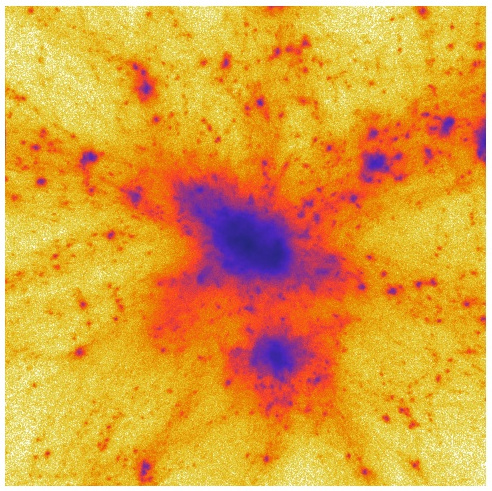

pycola3
=======

Author: Svetlin Tassev

Ported to Python 3 by [Phil Bull](http://philbull.com/)

Website: [pycola3](https://github.com/philbull/pycola3) | [Original pyCOLA](https://bitbucket.org/tassev/pycola)

Documentation (old version): [PDF Documentation](https://github.com/philbull/pycola3/files/6911023/pyCOLA.pdf)

License: [GPLv3+ License](https://www.gnu.org/licenses/gpl-3.0.html)

Introduction
------------

``pycola3`` is a multithreaded Python/Cython N-body code, implementing the
Comoving Lagrangian Acceleration (COLA) method in the temporal and
spatial domains. ``pycola3`` also implements a novel method to compute
second-order cosmological initial conditions for given initial
conditions at first-order for arbitrary initial particle configurations
(including glass initial conditions, as well as initial conditions
having refined subregions).

``pycola3`` is based on the following two papers:
[temporalCOLA](#temporalCOLA) and [spatialCOLA](#spatialCOLA). We kindly
ask you to acknowledge them and their authors in any program or
publication in which you use the COLA method in the temporal and/or
spatial domains. (We do not *require* you to, however, as we want
pyCOLA to be GPLv3 compatible.)

**Footnotes**

``pycola3`` requires [NumPy](http://www.numpy.org/),
[SciPy](http://www.scipy.org/),
[pyFFTW](https://github.com/pyFFTW/pyFFTW),
[h5py](http://www.h5py.org/), as well as their respective dependencies.

All lengthscales are in units of comoving Mpc/h, unless otherwise specified.

Worked-out example
------------------

The following example is contained in `examples/example.py`. It reads in a
MUSIC-generated initial conditions at first order; calculates the
second-order initial displacements on the full box; then runs COLA and
finally outputs a figure containing a density slice. The script needs
[matplotlib](http://matplotlib.org/) to be installed.

To run the script, first generate MUSIC initial conditions with the
included configuration file:

    MUSIC ics.conf

Then change the variable `music_file` below to point to the MUSIC
snapshot, and then execute the example script by issuing:

    python ./example.py

This example script was used with minor modifications in making the
figures for the paper. It fits comfortably on 24GB RAM. If that is not
available, decreasing `gridscale` to 1, reduces RAM consumption to 11GB
at the cost of reducing force resolution and producing artifacts.

Most of the time, the script spends on calculating the second-order
displacement field for the whole box, i.e. not on the COLA calculation.
On the 4-core laptop that the calculations for the paper were performed
on, the COLA calculation itself takes about 40 seconds.

The script produces the following figure:

References
----------

[MUSIC]: Multi-scale initial conditions for cosmological
    simulations, O. Hahn, T. Abel, Monthly Notices of the
    Royal Astronomical Society, 415, 2101 (2011),
    [arXiv:1103.6031](http://http://arxiv.org/abs/1103.6031). The code
    can be found on [this website](http://www.phys.ethz.ch/~hahn/MUSIC/).

[spatialCOLA]: Extending the N-body Comoving Lagrangian Acceleration Method to the
    Spatial Domain, S. Tassev, D. J. Eisenstein, B. D.
    Wandelt, M. Zaldarriaga, (2015),
    [arXiv:1502.07751](http://arxiv.org/abs/arXiv:1502.07751)

[temporalCOLA]: Solving Large Scale Structure in Ten Easy Steps with
    COLA, S. Tassev, M. Zaldarriaga, D. J. Eisenstein,
    Journal of Cosmology and Astroparticle Physics, 06, 036 (2013),
    [arXiv:1301.0322](http://arxiv.org/abs/arXiv:1301.0322)
