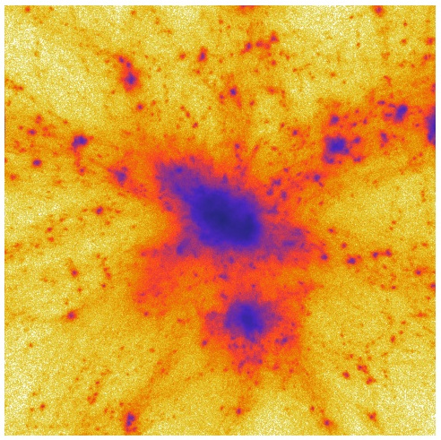

The following example is contained in :download:`example.py`. It 
reads in a MUSIC-generades initial conditions at first order; 
calculates the second order initial displacements on the full box; 
then runs COLA and finally outputs a figure containing a density 
slice. The script needs `matplotlib <http://matplotlib.org/>`_ to be 
installed.

To run the script, execute:: 

    python ./example.py

This example script was used with minor modifications in making the 
figures for the paper. It fits comfortably on 24GB ram. If that is not 
available, decreasing ``gridscale`` to 1, reduces ram consumption to 
11GB at the cost of reducing force resolution and producing artifacts. 

Most of the time, the script spends on calculating the second-order 
displacement field for the whole box, i.e. not on the COLA calculation. 
On the 4-core laptop the calculations for the paper were performed, the 
COLA calculation itself takes about 40 seconds.

The script produces the following figure:

   
.. literalinclude:: example.py
   :lines: 25-

.. automodule:: example
..    :members:
..    :undoc-members:
    :show-inheritance:

